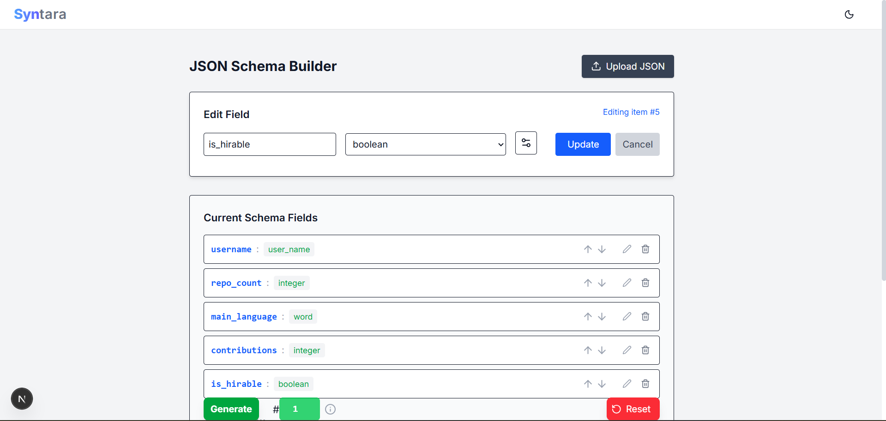
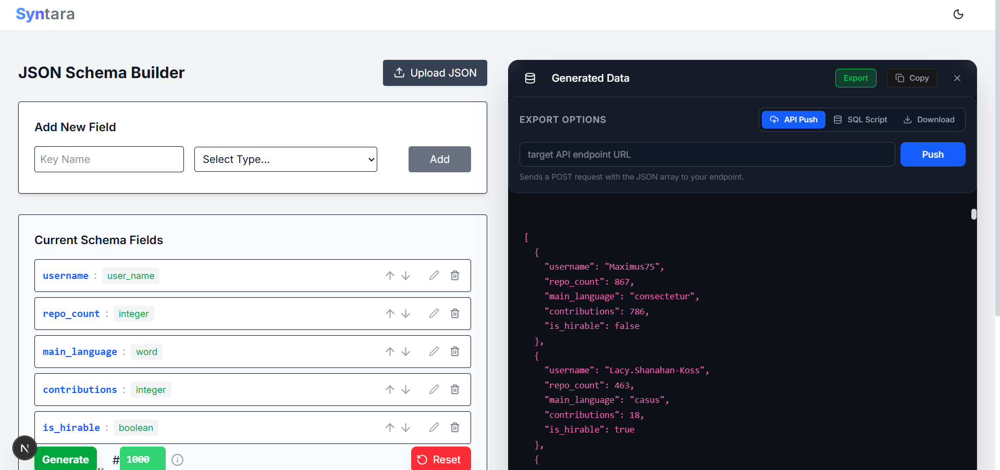
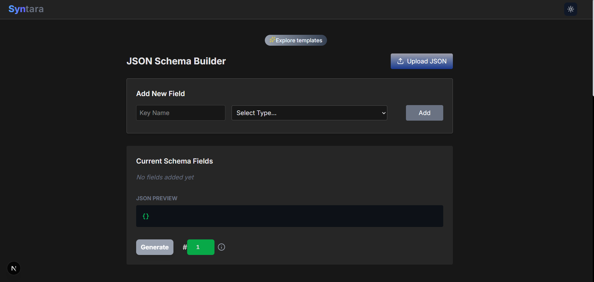
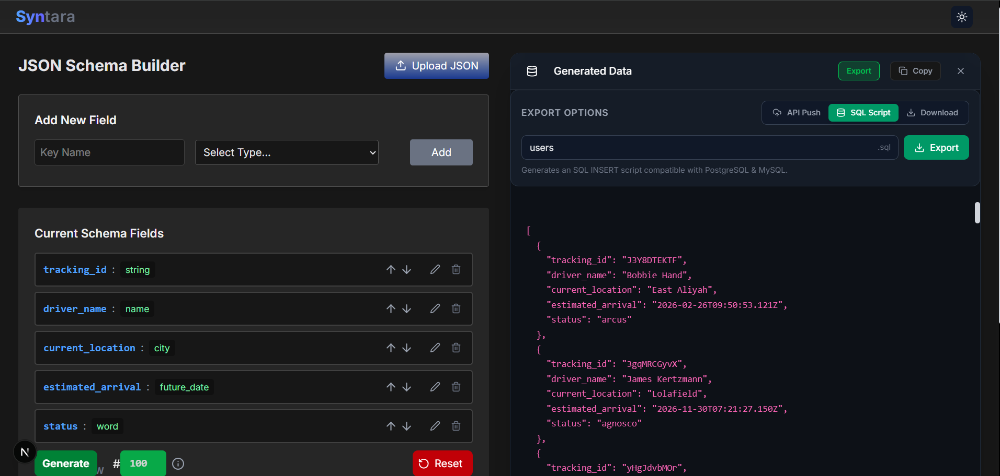

# Syntara: The Synthetic Data Engine


**Syntara** is a production-ready mock data generator designed for developers who need realistic test data instantly. It combines a visual schema builder with various export options, allowing you to seed databases, test APIs or download directly in seconds.

##  Features

* **Visual Schema Builder:** Create complex nested JSON structures without writing code.
* **Smart Templates:** Includes 18 pre-built schemas for E-commerce, Finance, Healthcare, and IoT.
* **Multi-Format Export:**
    * **JSON:** Standard download for frontend mocking.
    * **SQL:** Auto-generates `INSERT` scripts compatible with PostgreSQL & MySQL.
    * **API Push:** POST generated data directly to your backend endpoint with one click.
* **Dockerized:** Fully containerized for easy local deployment.
* **Secure:** Type-safe and built with modern security best practices.

## Tech Stack

* **Frontend:** Next.js 14 (App Router), React, Tailwind CSS
* **Language:** TypeScript
* **Icons:** Lucide React
* **Deployment:** Docker / Vercel

##  Installation & Setup

### Option 1: Running with Docker (Recommended)

You can spin up the entire application locally without installing Node.js.

1.  **Build the Image:**
    ```bash
    docker build -t syntara .
    ```

2.  **Run the Container:**
    ```bash
    docker run -p 3000:3000 syntara
    ```

3.  **Access App:** Open `http://localhost:3000`

### Option 2: Running Locally (Development)

1.  **Clone the repository:**
    ```bash
    git clone https://github.com/Adarsh-P-A/Syntara-DataForge.git
    cd Syntara-DataForge
    ```

2.  **Install dependencies:**
    ```bash
    npm install
    ```

3.  **Start the server:**
    ```bash
    npm run dev
    ```

## Usage Guide

### 1. Generating Data
1.  Select a **Template** (e.g., "User Profile") or build your own schema or upload a JSON schema. Make use of constraints
2.  Input the **Rows** needed in the box near generate button (e.g., 500 rows).
3.  Click **Generate**. Either you can copy or **download** the generated data as JSON or **Seed database** or **Push to API**

### 2. Seeding a Database (SQL Mode)
Syntara allows you to perform "Database Seeding" without connecting directly to your DB.
1.  Switch the Export Toggle to **SQL Script**.
2.  Enter your target Table Name (e.g., `users`).
3.  Click **Export**.
4.  Run the downloaded `.sql` file in your database tool (DBeaver, pgAdmin, or CLI).

*Note: The script automatically handles nested JSON objects and arrays.*

### 3. Testing APIs (Push Mode)
1.  Switch the Export Toggle to **API Push**.
2.  Enter your localhost or staging URL (e.g., `http://localhost:8000/api/bulk-users`).
3.  Click **Push**. The app will send a POST request with the data body.

Screenshots:





